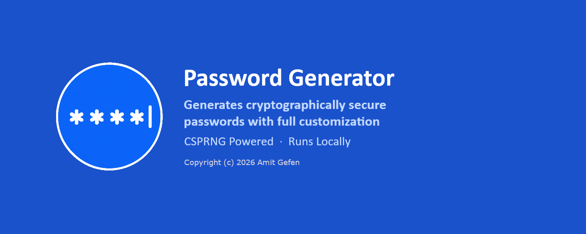

# Password Generator

A local WPF app for generating cryptographically random passwords on Windows.

For scripted or automated password generation (CI pipelines, other local tooling), see `New-CryptoPassword.ps1` instead - it implements the same algorithm in PowerShell with no compiled artifact required.

## Features

- **Character-based generation**: length 4-128, independently toggleable uppercase/lowercase/digits/symbols, optional exclusion of visually ambiguous characters (l, 1, I, O, 0). Every selected character type is guaranteed to appear at least once.
- All randomness comes from `System.Security.Cryptography.RandomNumberGenerator` - a CSPRNG, not a general-purpose PRNG - for both character selection and shuffling.
- Live character-pool size shown as you toggle character types, before generating.
- Entropy (bits) and search space (pool size ^ length, plus its order of magnitude) shown for the password actually generated - frozen to that result, not a live preview that could drift from it.
- Copy to clipboard via an inline icon on the password field, with a "Copied" confirmation, or automatically on every generate ("Copy on generate").
- Follows the Windows light/dark app setting automatically - at launch and live if the setting changes while the app is running, including the native title bar.

## Requirements

- .NET 10 SDK
- Windows 11
- `Microsoft.Win32.Registry` NuGet package (used to read the Windows theme setting)

## Building and running

```
dotnet build
dotnet run --project PasswordGenerator/PasswordGenerator.csproj
```

`dotnet build` accepts a `.slnx` solution directly. `dotnet run` doesn't resolve a project out of a solution on its own, though - it needs pointing at one specific `.csproj` - so run it with `--project`, or `cd` into the `PasswordGenerator` project folder first and run it bare from there.

## Project layout

| File | Purpose |
|---|---|
| `CryptoPasswordGenerator.cs` | Generation logic (`PasswordOptions`, `Generate`, `GetMaximumEntropyBits`, `GetPoolSize`). No UI dependency - entropy/search-space *display formatting* lives in `MainWindow.xaml.cs` instead, since that's a presentation concern. |
| `MainWindow.xaml` / `.xaml.cs` | UI layout (Generated Password, Length, Character Types, Generation cards) and event wiring: generate, copy-with-confirmation, length hover-popup slider, live pool-size updates, and the `WM_SETTINGCHANGE` hook for live theme/title-bar updates. |
| `App.xaml` / `App.xaml.cs` | Merges the design-system resource dictionaries; reads the Windows light/dark registry setting and merges the matching theme dictionary before the window is created. |
| `Resources/Styles.*.xaml` | Styles for Button, CheckBox, RadioButton, Slider, TextBox, plus Card/Decision/Tabs styles. Every color is a `DynamicResource` - no literal colors, aside from `Transparent`. |
| `Resources/Theme.Light.xaml`, `Resources/Theme.Dark.xaml` | The only files that define actual color values, under the same set of semantic keys. Swapping which one is merged retheme's the whole app live. |
| `Resources/password_generator.ico` | Application/window icon (multi-resolution, transparent background). |

## Notes

- The character-class guarantee ("every selected type appears at least once") is unconditional by design - there's no scenario where selecting a character type but excluding it from the result would be useful, so it isn't exposed as a toggle.
- The Symbols character class is the full standard 32-character punctuation set, including both quote characters (`"` and `'`). A separate "shell-safe" or "escaping-safe" toggle was considered and rejected - see the project's Confluence page for the rationale. If you're pasting a generated password into a shell command, CSV file, JSON string, or unparameterized SQL statement, quote or escape it at that point rather than expecting the generator to avoid problem characters.
- Dark theme details - including why control text color and the title bar each needed an explicit fix rather than relying on WPF defaults - are documented on the project's Confluence page, not repeated here.
